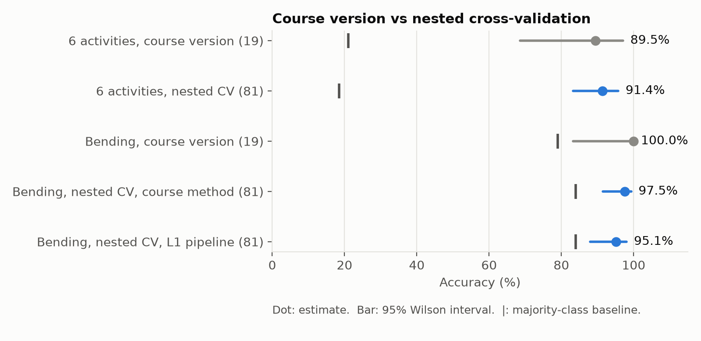
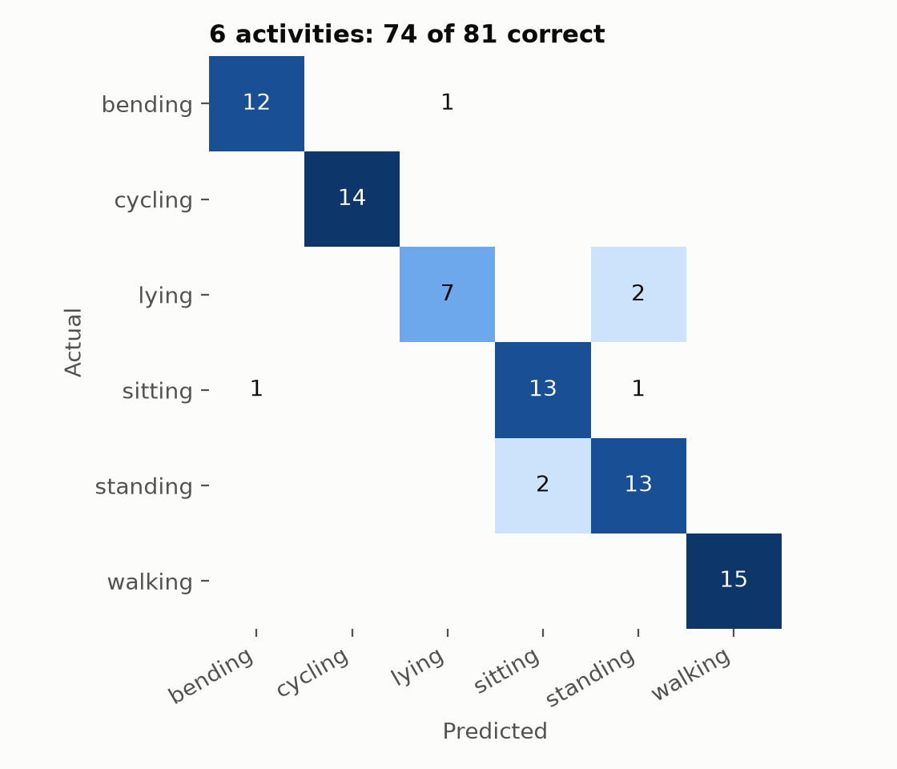
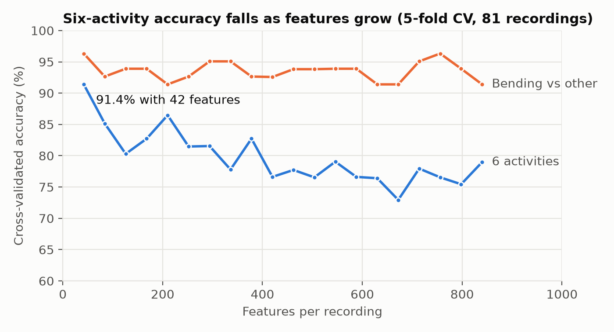

# Activity recognition from wireless sensor data

This project classifies six human activities (bending, cycling, lying, sitting, standing, and walking) from
the radio signal strength between three wireless sensors worn on the chest and both ankles. Given a two-minute
recording, the model predicts which activity the wearer was doing. It uses the
[UCI AReM dataset](https://archive.ics.uci.edu/dataset/366/activity+recognition+system+based+on+multisensor+data+fusion+arem).

It began as two course assignments, called the course version below. This repo rebuilds that work as a tested
Python package, reproduces its results, and then re-evaluates them with stricter methods.

## Results

**Six activities: 74/81 recordings correct (91.4%), 95% CI 83.2% to 95.8%, against an 18.5% majority-class
baseline.** Every recording was predicted by a model that never saw it, using nested cross-validation.

| Task | Course version (19 test recordings) | Nested cross-validation (81 unique recordings) | Majority baseline (81 recordings) |
|---|---|---|---|
| Six activities | 17/19 (89.5%), 95% CI 68.6% to 97.1% | **74/81 (91.4%), 95% CI 83.2% to 95.8%** | 18.5% |
| Bending vs other, course method | 19/19 (100.0%), 95% CI 83.2% to 100.0% | 79/81 (97.5%), 95% CI 91.4% to 99.3% | 84.0% |
| Bending vs other, L1 pipeline | not run | 77/81 (95.1%), 95% CI 88.0% to 98.1% | 84.0% |



- **The six-activity result holds up.** It matches the course version's 89.5% with four times the evidence and a
  much narrower interval. All five outer folds chose the same setting, one segment per recording.
- **The bending result rested on thin evidence.** The course version's 100% came from 19 test recordings, four of
  which had an exact copy in training, and its own 95% interval reached down to 83.2%. On the 81 unique recordings under nested cross-validation, the course method
  scores 97.5%. The L1 pipeline used for six activities scores 95.1%: it never raises a false alarm but misses 4 of
  the 13 bending recordings. Both beat an 84.0% baseline, which is high because most recordings are not bending.
- **The errors are among still postures.** Of the seven six-activity errors, three confuse sitting with standing
  and two read lying as standing. Cycling and walking are classified perfectly.



## What the re-evaluation found

**Seven of the 88 files are copies.** Six files in `lying` and one in `cycling` duplicate other files row for row,
so the dataset holds 81 unique recordings. `data/check_independence.py` finds them by comparing every pair of files.

**The course version's test set leaked.** Its split put 4 of the 19 test recordings on the opposite side from their
copies in training. Removing those four had no detectable effect (13/15 and 15/15 correct), though 15 recordings is
too few to rule out a small one.

**The course version reported the best of many settings.** It tried 20 segment counts and, for the binary task,
every feature count within each, then reported the best cross-validation score. Nested cross-validation chooses
the setting inside each training fold instead. For six activities, one segment wins by a wide margin, so choosing
it after the fact changed nothing (91.4% either way). For the binary task, the drop from 100% mixes four changes
(a larger test set, removed leaks, removed copies, and nested selection), and this project does not separate them.

**More features made the model worse.** With 81 recordings, six-activity accuracy falls from 91.4% at 42 features
to 73% to 79% at 420 or more, once features outnumber recordings five to one.



**Feature names were scrambled.** The course version computed features signal by signal but named them segment by
segment, so for any segment count above 1 most column names were wrong (70 of 84 with two segments). Accuracy was
unaffected, and the course version's reported models used one segment, where the names happen to line up.

## Engineering approach

- **Reproduce before you improve.** Before changing the method, the port had to return all 40 of the course
  version's cross-validation scores. Otherwise any later difference could be a porting bug.
  (`scripts/run_experiments.py`, `tests/test_features.py`)
- **Audit the data before trusting the model.** A pairwise scan found 7 duplicate files in a widely used public
  dataset. (`data/check_independence.py`)
- **Never report a number without its baseline and uncertainty.** Every accuracy here sits beside a majority-class
  baseline and a 95% interval. (`src/arwsn/evaluation.py`)
- **Keep model selection away from evaluation data.** Settings are chosen inside each training fold, and a test
  proves held-out recordings never reach selection. (`tests/test_evaluation.py`)
- **Test the tests.** The verifier plants realistic bugs and confirms a test catches each one.
  (`scripts/verify.py`)
- **One source of truth for results.** Figures, notebooks, and this README all read `results/metrics.json`, and a
  check fails if this README disagrees with it.
- **Report what you can't claim.** Single subject, small sample, one fold split, and an effect that could not be
  separated are stated, not buried.

## Method

1. `src/arwsn/loading.py` parses all 88 files into one table, one row per 250 ms sample, and drops the 7 copies.
2. `src/arwsn/features.py` cuts each recording into `l` equal time segments. For each segment and each of the six
   signals, it computes min, quartiles, median, mean, max, and standard deviation: 42 features per segment, one row
   per recording.
3. `src/arwsn/models.py` defines the models. With 81 recordings, a regularized linear model is the right size: an
   L1-regularized logistic regression picks a small set of features and stays interpretable. The six-activity model
   standardizes features, keeps those an L1 logistic regression selects, and fits an L1 multinomial logistic
   regression. The course version's binary model uses recursive feature elimination on a nearly unregularized
   logistic regression.
4. `src/arwsn/evaluation.py` runs nested cross-validation: 5 outer folds, with `l` from 1 to 20 chosen by 5-fold
   cross-validation inside each outer training fold. Feature selection is refit in every fold. Accuracy is pooled
   over all 81 out-of-fold predictions, with a Wilson 95% interval that treats recordings as independent trials.

The port reproduces the course version before changing it: all 40 of its per-`l` cross-validation scores (exactly
for the binary task, to the 3 printed decimals for six activities) and both of its test results.

## Limitations

- **One subject.** All recordings come from one person, so the results describe how well the model separates that
  person's activities. They do not show that it works on anyone else.
- **Small sample.** The six-activity interval is about 13 points wide.
- **One fold split.** The nested results come from one outer and one inner split. A different split could move them
  by a few points.

## Run it

```bash
python -m venv .venv
.venv/bin/pip install -r requirements.txt -e .
.venv/bin/python data/download.py
.venv/bin/python -m pytest
.venv/bin/python scripts/run_experiments.py
.venv/bin/python scripts/make_figures.py
.venv/bin/python scripts/verify.py
.venv/bin/jupyter lab notebooks/
```

`run_experiments.py` takes about 25 minutes and writes every number above to `results/metrics.json`, which is
committed, so the figures, notebooks, and verification run without it. `verify.py` runs the tests, checks the data,
confirms the reproduction of the course version, checks that this README's numbers match `metrics.json`, plants
deliberate bugs to show the tests catch them, and writes [`reports/verification.md`](reports/verification.md).

## Layout

- `data/` holds the download script, the duplicate check, and [notes on the dataset](data/README.md).
- `src/arwsn/` holds the package: loading, features, models, and evaluation.
- `tests/` checks every module, including exact agreement with the course version's feature code.
- `scripts/` runs the experiments, draws the figures, and writes the verification report.
- `notebooks/01-data-and-features.ipynb` shows the signals, the duplicates, and the features.
- `notebooks/02-classification-and-evaluation.ipynb` walks through every result in this README.
- `results/` holds `metrics.json` and the figures.

## Data

Palumbo, F., Gallicchio, C., Pucci, R., & Micheli, A. (2016). Activity Recognition system based on Multisensor
data fusion (AReM) [Dataset]. UCI Machine Learning Repository. https://doi.org/10.24432/C5SS33. CC BY 4.0.
